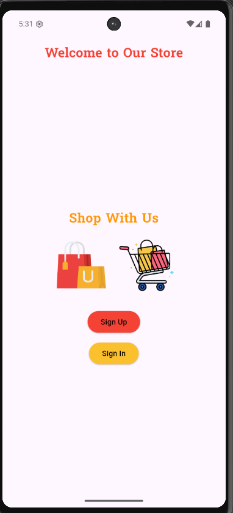
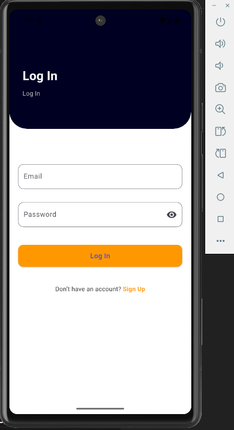
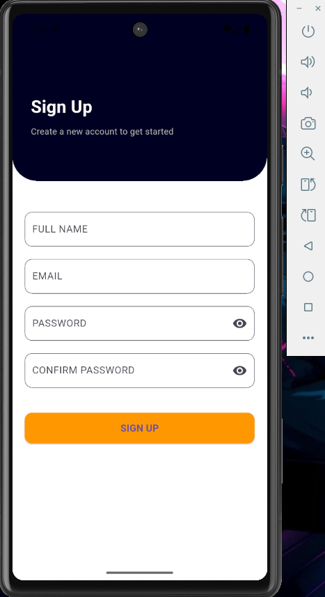
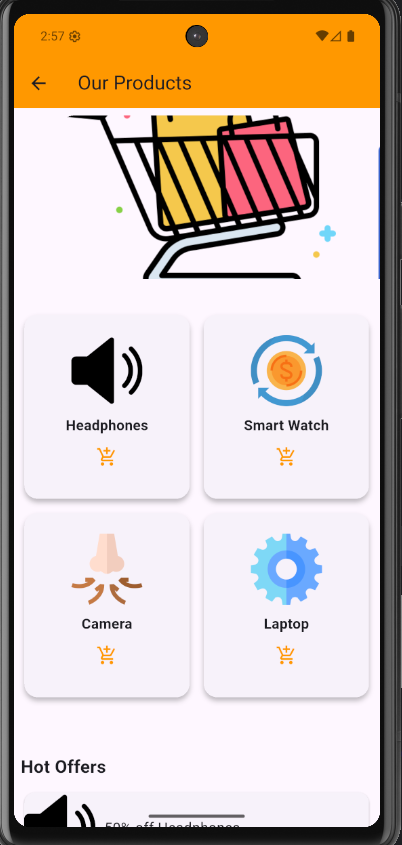

# ShoppingApp
Simple Shopping App — Flutter (Supports Arabic & English)

## Project overview
A small shopping UI demonstrating:
- Login / Signup
- Featured products (PageView)
- Product Grid (2 per row) with Add-to-cart SnackBar
- Hot Offers section
- Arabic/English localization using .arb & intl
- Smooth fade transitions between pages

## Features
- Animated navigation (fade)
- Localization (.arb files + generated AppLocalizations)
- Clean code: each screen/widget in separate file

- ## 📸 Screenshots

### 👋 Welcome Screen  

### 🔑 Login Screen  

### 📝 Sign Up Screen  

### 🏠 Home Screen  

